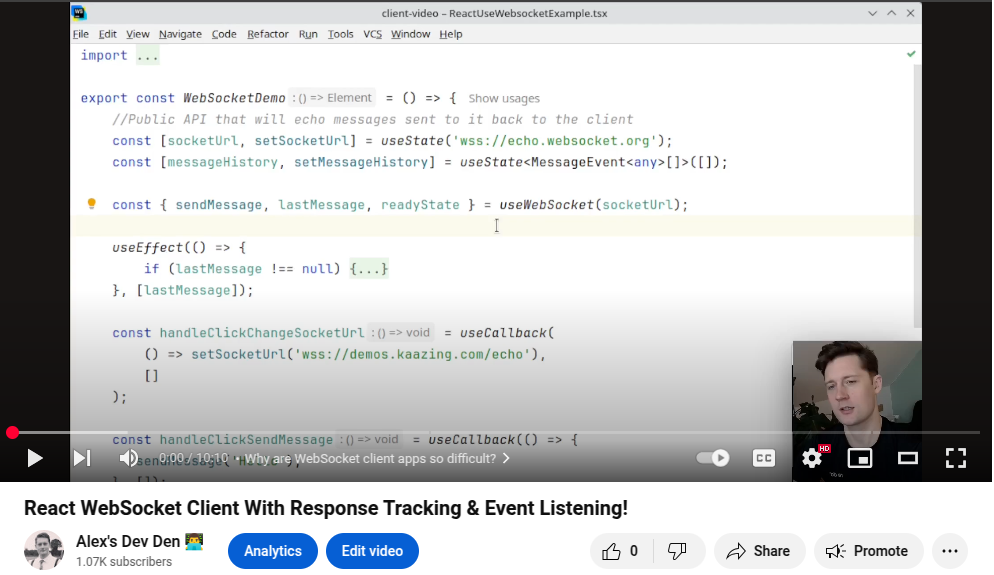
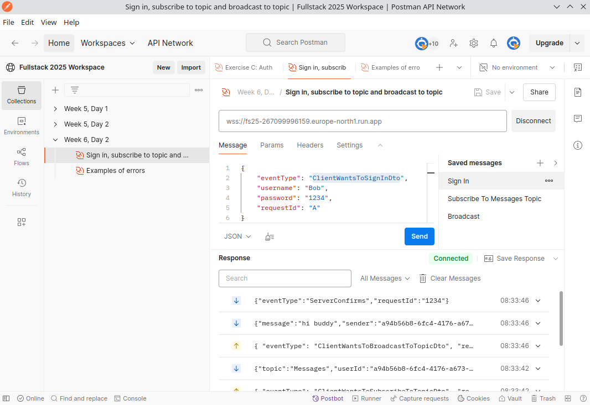

# Client Side Event Handling

Video link: `https://youtu.be/yWyQdM7sjOU`

#### Remote repo for today's lesson: `https://github.com/uldahlalex/fs25_6_2`

### Agenda

- 08:15: Presentation
- 08:40: Starting exercises

### Topics:

- Listening to events from server with requests
- Emitting and waiting for responses
- A pleasant revisit to React Vite and Typescript

### Exercises

Today there's is one singular (bigger) exercise

<!-- #region ex A -->

    
Today's Exercise: Client App for a WebSocket API

#### Introduction
Make a React websocket client app for an existing API.

To make the "starting point" even for everyone, I've deployed a WebSocket API *(using same technologies as last 2 lessons).*

It's running here: `wss://fs25-267099996159.europe-north1.run.app/` 

**You can build an run your own WebSocket API locally if you prefer - using above's link just means you don't need to have finished an entire API before making the client app** 

The API has 3 "success events" documented here: `https://www.postman.com/uldahlalexteam/fullstack-2025-workspace/ws-raw-request/6790105669c951396fd94945`

#### Criteria

- Any WebSocket client library can be used, but I recommend one of following:
    - The popular react-use-websocket: (`https://www.npmjs.com/package/react-use-websocket`) 
    - This custom wrapper `https://www.npmjs.com/package/ws-request-hook` which provides extra functionality (request tracking & event listening)
        - You can find documentation here: `https://github.com/uldahlalex/ws-request-hook` (see README.md). Today's video also demonstrates usage.
- Features:
    - It should be possible for a client to sign in
    - It should be possible for a client to "subscribe" to a "topic" and afterwards receive messages broadcasted from the API to the particular topic
    - It should be possible for a client to broadcast messages to a topic

Check that the subscription and broadcasting works multi-client (2 browser windows)

#### Solution example:

I've made a small react app using ws-request-hook in the "example" directory here: `https://github.com/uldahlalex/ws-request-hook/tree/main/examples`

#### Tips:

- Don't spend a lot of time on the graphical UI: Focus on getting the client-server communication to work

<!--  -->

<!-- #endregion ex A -->

#### Going forward:

If you manage to be done with today's exercise, I recommend you make a new WebSocket API from scratch (with different features) and implement requestId's for request-response patterns. 
In general: If you can perform full client-server CRUD, you are well prepared for the contents after the winter holiday. 

_______

